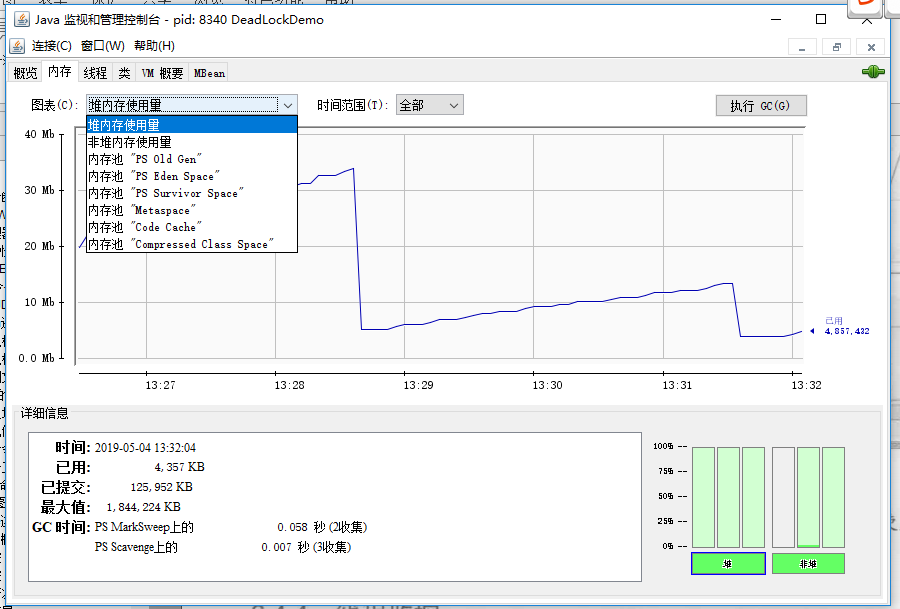

<!-- TOC -->

- [JDK 监控和故障处理工具总结](#jdk-监控和故障处理工具总结)
    - [JDK 命令行工具](#jdk-命令行工具)
        - [`jps`:查看所有 Java 进程](#jps查看所有-java-进程)
        - [`jstat`: 监视虚拟机各种运行状态信息](#jstat-监视虚拟机各种运行状态信息)
        - [` jinfo`: 实时地查看和调整虚拟机各项参数](#-jinfo-实时地查看和调整虚拟机各项参数)
        - [`jmap`:生成堆转储快照](#jmap生成堆转储快照)
        - [**`jhat`**: 分析 heapdump 文件](#jhat-分析-heapdump-文件)
        - [**`jstack`** :生成虚拟机当前时刻的线程快照](#jstack-生成虚拟机当前时刻的线程快照)
    - [JDK 可视化分析工具](#jdk-可视化分析工具)
        - [JConsole:Java 监视与管理控制台](#jconsolejava-监视与管理控制台)
            - [连接 Jconsole](#连接-jconsole)
            - [查看 Java 程序概况](#查看-java-程序概况)
            - [内存监控](#内存监控)
            - [线程监控](#线程监控)
        - [Visual VM:多合一故障处理工具](#visual-vm多合一故障处理工具)

<!-- /TOC -->

# JDK 监控和故障处理工具总结

## JDK 命令行工具

这些命令在 JDK 安装目录下的 bin 目录下：

- **`jps`** (JVM Process Status）: 类似 UNIX 的 `ps` 命令。用户查看所有 Java 进程的启动类、传入参数和 Java 虚拟机参数等信息；
- **`jstat`**（ JVM Statistics Monitoring Tool）:  用于收集 HotSpot 虚拟机各方面的运行数据;
- **`jinfo`** (Configuration Info for Java) : Configuration Info forJava,显示虚拟机配置信息;
- **`jmap`** (Memory Map for Java) :生成堆转储快照;
- **`jhat`** (JVM Heap Dump Browser ) : 用于分析 heapdump 文件，它会建立一个 HTTP/HTML 服务器，让用户可以在浏览器上查看分析结果;
- **`jstack`** (Stack Trace for Java):生成虚拟机当前时刻的线程快照，线程快照就是当前虚拟机内每一条线程正在执行的方法堆栈的集合。

### `jps`:查看所有 Java 进程

`jps`(JVM Process Status) 命令类似 UNIX 的 `ps` 命令。

`jps`：显示虚拟机执行主类名称以及这些进程的本地虚拟机唯一 ID（Local Virtual Machine Identifier,LVMID）。`jps -q` ：只输出进程的本地虚拟机唯一 ID。

```powershell
C:\Users\SnailClimb>jps
7360 NettyClient2
17396
7972 Launcher
16504 Jps
17340 NettyServer
```

`jps -l`:输出主类的全名，如果进程执行的是 Jar 包，输出 Jar 路径。

```powershell
C:\Users\SnailClimb>jps -l
7360 firstNettyDemo.NettyClient2
17396
7972 org.jetbrains.jps.cmdline.Launcher
16492 sun.tools.jps.Jps
17340 firstNettyDemo.NettyServer
```

`jps -v`：输出虚拟机进程启动时 JVM 参数。

`jps -m`：输出传递给 Java 进程 main() 函数的参数。

### `jstat`: 监视虚拟机各种运行状态信息

jstat（JVM Statistics Monitoring Tool） 使用于监视虚拟机各种运行状态信息的命令行工具。 它可以显示本地或者远程（需要远程主机提供 RMI 支持）虚拟机进程中的类信息、内存、垃圾收集、JIT 编译等运行数据，在没有 GUI，只提供了纯文本控制台环境的服务器上，它将是运行期间定位虚拟机性能问题的首选工具。

**`jstat` 命令使用格式：**

```powershell
jstat -<option> [-t] [-h<lines>] <vmid> [<interval> [<count>]]
```

比如 `jstat -gc -h3 31736 1000 10`表示分析进程 id 为 31736 的 gc 情况，每隔 1000ms 打印一次记录，打印 10 次停止，每 3 行后打印指标头部。

**常见的 option 如下：**

- `jstat -class vmid` ：显示 ClassLoader 的相关信息；
- `jstat -compiler vmid` ：显示 JIT 编译的相关信息；
- `jstat -gc vmid` ：显示与 GC 相关的堆信息；
- `jstat -gccapacity vmid` ：显示各个代的容量及使用情况；
- `jstat -gcnew vmid` ：显示新生代信息；
- `jstat -gcnewcapcacity vmid` ：显示新生代大小与使用情况；
- `jstat -gcold vmid` ：显示老年代和永久代的行为统计，从jdk1.8开始,该选项仅表示老年代，因为永久代被移除了；
- `jstat -gcoldcapacity vmid` ：显示老年代的大小；
- `jstat -gcpermcapacity vmid` ：显示永久代大小，从jdk1.8开始,该选项不存在了，因为永久代被移除了；
- `jstat -gcutil vmid` ：显示垃圾收集信息；

另外，加上 `-t`参数可以在输出信息上加一个 Timestamp 列，显示程序的运行时间。

### ` jinfo`: 实时地查看和调整虚拟机各项参数

`jinfo vmid` :输出当前 jvm 进程的全部参数和系统属性 (第一部分是系统的属性，第二部分是 JVM 的参数)。

`jinfo -flag name vmid` :输出对应名称的参数的具体值。比如输出 MaxHeapSize、查看当前 jvm 进程是否开启打印 GC 日志 ( `-XX:PrintGCDetails` :详细 GC 日志模式，这两个都是默认关闭的)。

```powershell
C:\Users\SnailClimb>jinfo  -flag MaxHeapSize 17340
-XX:MaxHeapSize=2124414976
C:\Users\SnailClimb>jinfo  -flag PrintGC 17340
-XX:-PrintGC
```

使用 jinfo 可以在不重启虚拟机的情况下，可以动态的修改 jvm 的参数。尤其在线上的环境特别有用,请看下面的例子：

`jinfo -flag [+|-]name vmid` 开启或者关闭对应名称的参数。

```powershell
C:\Users\SnailClimb>jinfo  -flag  PrintGC 17340
-XX:-PrintGC

C:\Users\SnailClimb>jinfo  -flag  +PrintGC 17340

C:\Users\SnailClimb>jinfo  -flag  PrintGC 17340
-XX:+PrintGC
```

### `jmap`:生成堆转储快照

`jmap`（Memory Map for Java）命令用于生成堆转储快照。 如果不使用 `jmap` 命令，要想获取 Java 堆转储，可以使用 `“-XX:+HeapDumpOnOutOfMemoryError”` 参数，可以让虚拟机在 OOM 异常出现之后自动生成 dump 文件，Linux 命令下可以通过 `kill -3` 发送进程退出信号也能拿到 dump 文件。

`jmap` 的作用并不仅仅是为了获取 dump 文件，它还可以查询 finalizer 执行队列、Java 堆和永久代的详细信息，如空间使用率、当前使用的是哪种收集器等。和`jinfo`一样，`jmap`有不少功能在 Windows 平台下也是受限制的。

示例：将指定应用程序的堆快照输出到桌面。后面，可以通过 jhat、Visual VM 等工具分析该堆文件。

```powershell
C:\Users\SnailClimb>jmap -dump:format=b,file=C:\Users\SnailClimb\Desktop\heap.hprof 17340
Dumping heap to C:\Users\SnailClimb\Desktop\heap.hprof ...
Heap dump file created
```

### **`jhat`**: 分析 heapdump 文件

 **`jhat`** 用于分析 heapdump 文件，它会建立一个 HTTP/HTML 服务器，让用户可以在浏览器上查看分析结果。

```powershell
C:\Users\SnailClimb>jhat C:\Users\SnailClimb\Desktop\heap.hprof
Reading from C:\Users\SnailClimb\Desktop\heap.hprof...
Dump file created Sat May 04 12:30:31 CST 2019
Snapshot read, resolving...
Resolving 131419 objects...
Chasing references, expect 26 dots..........................
Eliminating duplicate references..........................
Snapshot resolved.
Started HTTP server on port 7000
Server is ready.
```

访问 <http://localhost:7000/>

### **`jstack`** :生成虚拟机当前时刻的线程快照

`jstack`（Stack Trace for Java）命令用于生成虚拟机当前时刻的线程快照。线程快照就是当前虚拟机内每一条线程正在执行的方法堆栈的集合.

生成线程快照的目的主要是定位线程长时间出现停顿的原因，如线程间死锁、死循环、请求外部资源导致的长时间等待等都是导致线程长时间停顿的原因。线程出现停顿的时候通过`jstack`来查看各个线程的调用堆栈，就可以知道没有响应的线程到底在后台做些什么事情，或者在等待些什么资源。

**下面是一个线程死锁的代码。我们下面会通过 `jstack` 命令进行死锁检查，输出死锁信息，找到发生死锁的线程。**

```java
public class DeadLockDemo {
    private static Object resource1 = new Object();//资源 1
    private static Object resource2 = new Object();//资源 2

    public static void main(String[] args) {
        new Thread(() -> {
            synchronized (resource1) {
                System.out.println(Thread.currentThread() + "get resource1");
                try {
                    Thread.sleep(1000);
                } catch (InterruptedException e) {
                    e.printStackTrace();
                }
                System.out.println(Thread.currentThread() + "waiting get resource2");
                synchronized (resource2) {
                    System.out.println(Thread.currentThread() + "get resource2");
                }
            }
        }, "线程 1").start();

        new Thread(() -> {
            synchronized (resource2) {
                System.out.println(Thread.currentThread() + "get resource2");
                try {
                    Thread.sleep(1000);
                } catch (InterruptedException e) {
                    e.printStackTrace();
                }
                System.out.println(Thread.currentThread() + "waiting get resource1");
                synchronized (resource1) {
                    System.out.println(Thread.currentThread() + "get resource1");
                }
            }
        }, "线程 2").start();
    }
}
```

Output

```
Thread[线程 1,5,main]get resource1
Thread[线程 2,5,main]get resource2
Thread[线程 1,5,main]waiting get resource2
Thread[线程 2,5,main]waiting get resource1
```

线程 A 通过 synchronized (resource1) 获得 resource1 的监视器锁，然后通过` Thread.sleep(1000);`让线程 A 休眠 1s 为的是让线程 B 得到执行然后获取到 resource2 的监视器锁。线程 A 和线程 B 休眠结束了都开始企图请求获取对方的资源，然后这两个线程就会陷入互相等待的状态，这也就产生了死锁。

**通过 `jstack` 命令分析：**

```powershell
C:\Users\SnailClimb>jps
13792 KotlinCompileDaemon
7360 NettyClient2
17396
7972 Launcher
8932 Launcher
9256 DeadLockDemo
10764 Jps
17340 NettyServer

C:\Users\SnailClimb>jstack 9256
```

输出的部分内容如下：

```powershell
Found one Java-level deadlock:
=============================
"线程 2":
  waiting to lock monitor 0x000000000333e668 (object 0x00000000d5efe1c0, a java.lang.Object),
  which is held by "线程 1"
"线程 1":
  waiting to lock monitor 0x000000000333be88 (object 0x00000000d5efe1d0, a java.lang.Object),
  which is held by "线程 2"

Java stack information for the threads listed above:
===================================================
"线程 2":
        at DeadLockDemo.lambda$main$1(DeadLockDemo.java:31)
        - waiting to lock <0x00000000d5efe1c0> (a java.lang.Object)
        - locked <0x00000000d5efe1d0> (a java.lang.Object)
        at DeadLockDemo$$Lambda$2/1078694789.run(Unknown Source)
        at java.lang.Thread.run(Thread.java:748)
"线程 1":
        at DeadLockDemo.lambda$main$0(DeadLockDemo.java:16)
        - waiting to lock <0x00000000d5efe1d0> (a java.lang.Object)
        - locked <0x00000000d5efe1c0> (a java.lang.Object)
        at DeadLockDemo$$Lambda$1/1324119927.run(Unknown Source)
        at java.lang.Thread.run(Thread.java:748)

Found 1 deadlock.
```

可以看到 `jstack` 命令已经帮我们找到发生死锁的线程的具体信息。

## JDK 可视化分析工具

### JConsole:Java 监视与管理控制台

JConsole 是基于 JMX 的可视化监视、管理工具。可以很方便的监视本地及远程服务器的 java 进程的内存使用情况。你可以在控制台输出`console`命令启动或者在 JDK 目录下的 bin 目录找到`jconsole.exe`然后双击启动。

#### 连接 Jconsole


如果需要使用 JConsole 连接远程进程，可以在远程 Java 程序启动时加上下面这些参数:

```properties
-Djava.rmi.server.hostname=外网访问 ip 地址 
-Dcom.sun.management.jmxremote.port=60001   //监控的端口号
-Dcom.sun.management.jmxremote.authenticate=false   //关闭认证
-Dcom.sun.management.jmxremote.ssl=false
```

在使用 JConsole 连接时，远程进程地址如下：

```
外网访问 ip 地址:60001 
```

#### 查看 Java 程序概况


#### 内存监控

JConsole 可以显示当前内存的详细信息。不仅包括堆内存/非堆内存的整体信息，还可以细化到 eden 区、survivor 区等的使用情况，如下图所示。

点击右边的“执行 GC(G)”按钮可以强制应用程序执行一个 Full GC。

> - **新生代 GC（Minor GC）**:指发生新生代的的垃圾收集动作，Minor GC 非常频繁，回收速度一般也比较快。
> - **老年代 GC（Major GC/Full GC）**:指发生在老年代的 GC，出现了 Major GC 经常会伴随至少一次的 Minor GC（并非绝对），Major GC 的速度一般会比 Minor GC 的慢 10 倍以上。



#### 线程监控

类似我们前面讲的 `jstack` 命令，不过这个是可视化的。

最下面有一个"检测死锁 (D)"按钮，点击这个按钮可以自动为你找到发生死锁的线程以及它们的详细信息 。


### Visual VM:多合一故障处理工具

VisualVM 提供在 Java 虚拟机 (Java Virutal Machine, JVM) 上运行的 Java 应用程序的详细信息。在 VisualVM 的图形用户界面中，您可以方便、快捷地查看多个 Java 应用程序的相关信息。Visual VM 官网：<https://visualvm.github.io/> 。Visual VM 中文文档:<https://visualvm.github.io/documentation.html>。

下面这段话摘自《深入理解 Java 虚拟机》。

> VisualVM（All-in-One Java Troubleshooting Tool）是到目前为止随 JDK 发布的功能最强大的运行监视和故障处理程序，官方在 VisualVM 的软件说明中写上了“All-in-One”的描述字样，预示着他除了运行监视、故障处理外，还提供了很多其他方面的功能，如性能分析（Profiling）。VisualVM 的性能分析功能甚至比起 JProfiler、YourKit 等专业且收费的 Profiling 工具都不会逊色多少，而且 VisualVM 还有一个很大的优点：不需要被监视的程序基于特殊 Agent 运行，因此他对应用程序的实际性能的影响很小，使得他可以直接应用在生产环境中。这个优点是 JProfiler、YourKit 等工具无法与之媲美的。

 VisualVM 基于 NetBeans 平台开发，因此他一开始就具备了插件扩展功能的特性，通过插件扩展支持，VisualVM 可以做到：

- **显示虚拟机进程以及进程的配置、环境信息（jps、jinfo）。**
- **监视应用程序的 CPU、GC、堆、方法区以及线程的信息（jstat、jstack）。**
- **dump 以及分析堆转储快照（jmap、jhat）。**
- **方法级的程序运行性能分析，找到被调用最多、运行时间最长的方法。**
- **离线程序快照：收集程序的运行时配置、线程 dump、内存 dump 等信息建立一个快照，可以将快照发送开发者处进行 Bug 反馈。**
- **其他 plugins 的无限的可能性......**

这里就不具体介绍 VisualVM 的使用，如果想了解的话可以看:

- <https://visualvm.github.io/documentation.html>
- <https://www.ibm.com/developerworks/cn/java/j-lo-visualvm/index.html>
