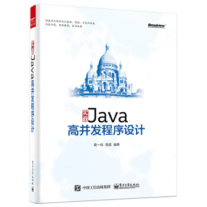
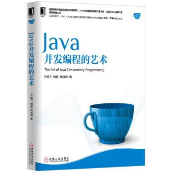

## 前言

这是我的第二篇专门介绍如何去学习某个知识点的文章，在上一篇[《写给 Java 程序员看的算法学习指南！》](https://mp.weixin.qq.com/s?__biz=Mzg2OTA0Njk0OA==&mid=2247486508&idx=1&sn=ce2faafcde166d5412d7166a01fdc1e9&chksm=cea243e7f9d5caf1dbf4d6ccf0438a1731bc0070310bba1ac481d485e4a6756349c20f02a6b1&token=211950660&lang=zh_CN#rd) 的文章中，我推荐了一些关于 **算法学习的书籍以及资源** 。

相比于写技术文章来说，写这种这种类型的文章实际花费的时间可能会稍微少一点。但是，这种学习指南形式的文章，我想对于 Java 初学者甚至是工作几年的 Java 工程师来说应该还是非常有帮助的！

我们都知道多线程应该是大部分 Java 程序员最难啃的一块骨头之一，这部分内容的难度跨度大，难实践，并且市面上的参考资料的质量也层次不齐。

在这篇文章中，我会首先介绍一下 **Java 多线程学习** 中比较重要的一些问题，然后还会推荐一些比较不错的学习资源供大家参考。希望对你们学习多线程相关的知识能有帮助。以下介绍的很多知识点你都可以在这里找到：[https://snailclimb.gitee.io/javaguide/#/?id=并发](https://snailclimb.gitee.io/javaguide/#/?id=并发)

**另外，我还将本文的内容同步到了 Github 上，点击阅读原文即可直达。如果你觉得有任何需要完善和修改的地方，都可以去 Github 给我提交 Issue 或者 PR（推荐）。**

## 一.Java 多线程知识点总结

### 1.1.多线程基础

1. 什么是线程和进程? 线程与进程的关系,区别及优缺点？
2. 说说并发与并行的区别?
3. 为什么要使用多线程呢?
4. 使用多线程可能带来什么问题?（内存泄漏、死锁、线程不安全等等）
5. 创建线程有哪几种方式？（a.继承 Thread 类;b.实现 Runnable 接口;c. 使用 Executor 框架;d.使用 FutureTask）
6. 说说线程的生命周期和状态?
7. 什么是上下文切换?
8. 什么是线程死锁?如何避免死锁?
9. 说说 sleep() 方法和 wait() 方法区别和共同点?
10. 为什么我们调用 start() 方法时会执行 run() 方法，为什么我们不能直接调用 run() 方法？
11. ......

### 1.2.多线程知识进阶

#### volatile 关键字

1. Java 内存模型（**JMM**）;
2. 重排序与 happens-before 原则了解吗?
3. volatile 关键字的作用;
4. 说说 synchronized 关键字和 volatile 关键字的区别;
5. ......

#### ThreadLocal

1. 有啥用（解决了什么问题）？怎么用？
2. 原理了解吗？
3. 内存泄露问题了解吗？

#### 线程池

1. 为什么要用线程池？
2. 你会使用线程池吗？
3. 如何创建线程池比较好？ （推荐使用 `ThreadPoolExecutor` 构造函数创建线程池）
4. `ThreadPoolExecutor` 类的重要参数了解吗？`ThreadPoolExecutor` 饱和策略了解吗？
5. 线程池原理了解吗？
6. 几种常见的线程池了解吗？为什么不推荐使用`FixedThreadPool`？
7. 如何设置线程池的大小？
8. ......

#### AQS

1. 简介
2. 原理
3. AQS 常用组件。
   - **Semaphore(信号量)**-允许多个线程同时访问
   - **CountDownLatch （倒计时器）**-CountDownLatch 允许 count 个线程阻塞在一个地方，直至所有线程的任务都执行完毕。
   - **CyclicBarrier(循环栅栏)**-CyclicBarrier 和 CountDownLatch 非常类似，它也可以实现线程间的技术等待，但是它的功能比 CountDownLatch 更加复杂和强大。主要应用场景和 CountDownLatch 类似。
   - **ReentrantLock 和 ReentrantReadWriteLock**
   - ......

#### 锁

锁的常见分类

1. 可重入锁和非可重入锁
2. 公平锁与非公平锁
3. 读写锁和排它锁

**synchronized 关键字**

1. 说一说自己对于 synchronized 关键字的了解；
2. 说说自己是怎么使用 synchronized 关键字，在项目中用到了吗;
3. 讲一下 synchronized 关键字的底层原理；
4. 说说 JDK1.6 之后的 synchronized 关键字底层做了哪些优化，可以详细介绍一下这些优化吗；
5. 谈谈 synchronized 和 ReentrantLock 的区别；
6. ......

**ReentrantLock 和 ReentrantReadWriteLock**

**ReadWriteLock**

**StampedLock（JDK8）**

#### **Atomic 与 CAS**

**CAS:**

1. 介绍
2. 原理

**Atomic 原子类：**

1.  介绍一下 Atomic 原子类；
2.  JUC 包中的原子类是哪 4 类?；
3.  讲讲 AtomicInteger 的使用；
4.  能不能给我简单介绍一下 AtomicInteger 类的原理。
5.  ......

#### 并发容器

JDK 提供的这些容器大部分在 `java.util.concurrent` 包中。

- **ConcurrentHashMap:** 线程安全的 HashMap
- **CopyOnWriteArrayList:** 线程安全的 List，在读多写少的场合性能非常好，远远好于 Vector.
- **ConcurrentLinkedQueue:** 高效的并发队列，使用链表实现。可以看做一个线程安全的 LinkedList，这是一个非阻塞队列。
- **BlockingQueue:** 这是一个接口，JDK 内部通过链表、数组等方式实现了这个接口。表示阻塞队列，非常适合用于作为数据共享的通道。
- **ConcurrentSkipListMap:** 跳表的实现。这是一个 Map，使用跳表的数据结构进行快速查找。
- ......

#### Future 和 CompletableFuture

## 二.书籍推荐

#### 《Java 并发编程之美》

**我觉得这本书还是非常适合我们用来学习 Java 多线程的。这本书的讲解非常通俗易懂，作者从并发编程基础到实战都是信手拈来。**

另外，这本书的作者加多自身也会经常在网上发布各种技术文章。我觉得这本书也是加多大佬这么多年在多线程领域的沉淀所得的结果吧！他书中的内容基本都是结合代码讲解，非常有说服力！

#### 《实战 Java 高并发程序设计》

这个是我第二本要推荐的书籍，比较适合作为多线程入门/进阶书籍来看。这本书内容同样是理论结合实战，对于每个知识点的讲解也比较通俗易懂，整体结构也比较清。

#### 《深入浅出 Java 多线程》

这本书是几位大厂（如阿里）的大佬开源的，Github 地址：[https://github.com/RedSpider1/concurrent](https://github.com/RedSpider1/concurrent)

几位作者为了写好《深入浅出 Java 多线程》这本书阅读了大量的 Java 多线程方面的书籍和博客，然后再加上他们的经验总结、Demo 实例、源码解析，最终才形成了这本书。

这本书的质量也是非常过硬！给作者们点个赞！这本书有统一的排版规则和语言风格、清晰的表达方式和逻辑。并且每篇文章初稿写完后，作者们就会互相审校，合并到主分支时所有成员会再次审校，最后再通篇修订了三遍。

#### 《Java 并发编程的艺术》

这本书不是很适合作为 Java 多线程入门书籍，需要具备一定的 JVM 基础，有些东西讲的还是挺深入的。另外，就我自己阅读这本书的感觉来说，我觉得这本书的章节规划有点杂乱，但是，具体到某个知识点又很棒！这可能也和这本书由三名作者共同编写完成有关系吧！

**综上：这本书并不是和 Java 多线程入门，你也不需要把这本书的每一章节都看一遍，建议挑选自己想要详细了解的知识点来看。**

## 三.总结

在这篇文章中我主要总结了 Java 多线程方面的知识点，并且推荐了相关的书籍。并发这部分东西实战的话比较难，你可以尝试学会了某个知识点之后然后在自己写过的一些项目上实践。另外，leetcode 有一个练习多线程的类别： [https://leetcode-cn.com/problemset/concurrency](https://leetcode-cn.com/problemset/concurrency) 可以作为参考。

**为了这篇文章的内容更加完善，我还将本文的内容同步到了 Github 上，点击阅读原文即可直达。如果你觉得有任何需要完善和修改的地方，都可以去 Github 给我提交 Issue 或者 PR（推荐）。**